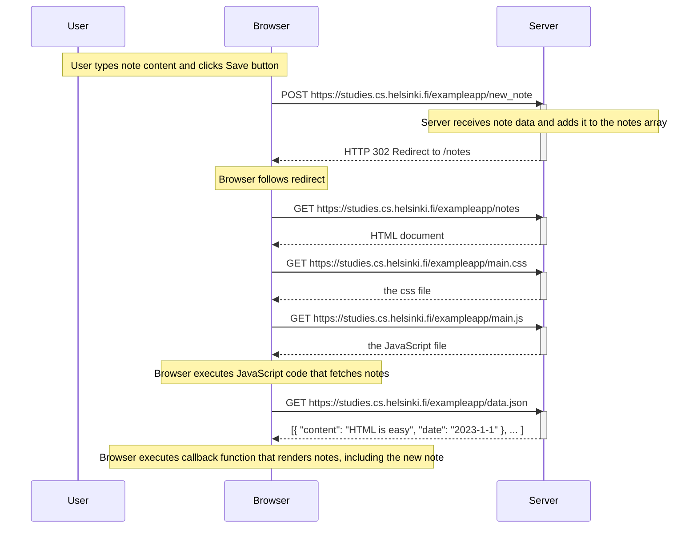

# New Note Creation Sequence Diagram

## Explanation of the Process

1. The user types a new note and clicks the Save button
2. The browser sends a POST request to the server with the new note data
3. The server adds the new note to its data and responds with a redirect
4. The browser follows the redirect and requests the notes page again
5. The server sends the HTML, CSS, and JavaScript files
6. The browser executes the JavaScript code which fetches the updated notes data
7. The browser renders all notes, including the newly added one 