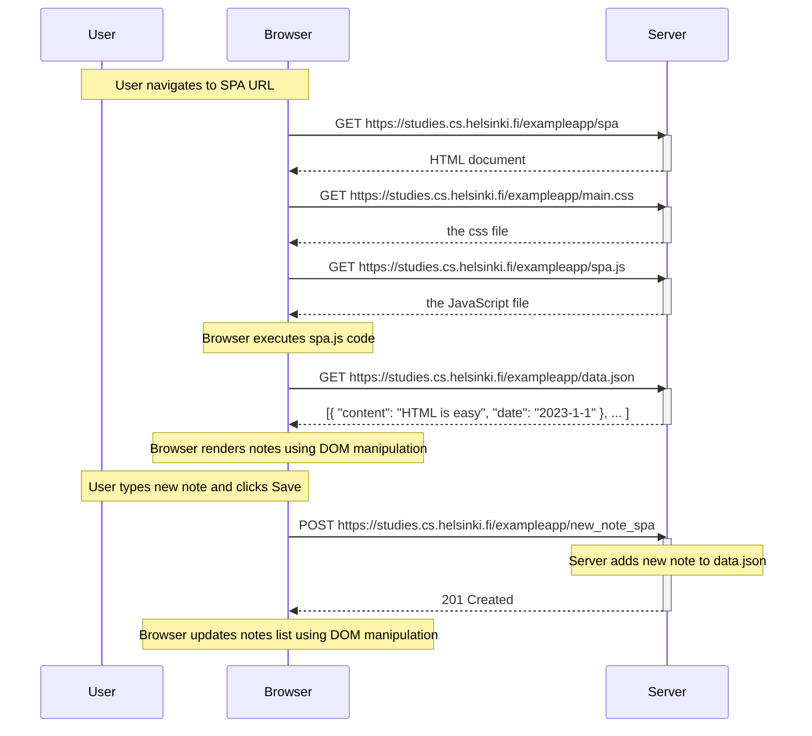

# Single Page App (SPA) Notes Application Diagram

```mermaid
sequenceDiagram
    participant User
    participant Browser
    participant Server

    Note over User,Browser: User navigates to SPA URL

    Browser->>Server: GET https://studies.cs.helsinki.fi/exampleapp/spa
    activate Server
    Server-->>Browser: HTML document
    deactivate Server

    Browser->>Server: GET https://studies.cs.helsinki.fi/exampleapp/main.css
    activate Server
    Server-->>Browser: the css file
    deactivate Server

    Browser->>Server: GET https://studies.cs.helsinki.fi/exampleapp/spa.js
    activate Server
    Server-->>Browser: the JavaScript file
    deactivate Server

    Note over Browser: Browser executes spa.js code

    Browser->>Server: GET https://studies.cs.helsinki.fi/exampleapp/data.json
    activate Server
    Server-->>Browser: [{ "content": "HTML is easy", "date": "2023-1-1" }, ... ]
    deactivate Server

    Note over Browser: Browser renders notes using DOM manipulation

    Note over User,Browser: User types new note and clicks Save

    Browser->>Server: POST https://studies.cs.helsinki.fi/exampleapp/new_note_spa
    activate Server
    Note over Server: Server adds new note to data.json
    Server-->>Browser: 201 Created
    deactivate Server

    Note over Browser: Browser updates notes list using DOM manipulation
``` 