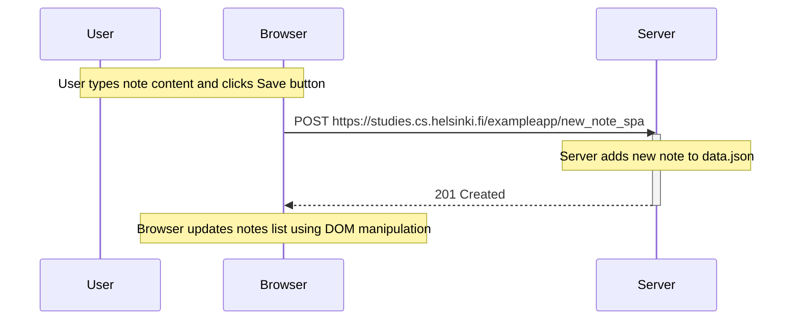

# New Note in Single Page App Diagram

```mermaid
sequenceDiagram
    participant User
    participant Browser
    participant Server

    Note over User,Browser: User types note content and clicks Save button

    Browser->>Server: POST https://studies.cs.helsinki.fi/exampleapp/new_note_spa
    activate Server
    Note over Server: Server adds new note to data.json
    Server-->>Browser: 201 Created
    deactivate Server

    Note over Browser: Browser updates notes list using DOM manipulation
``` 